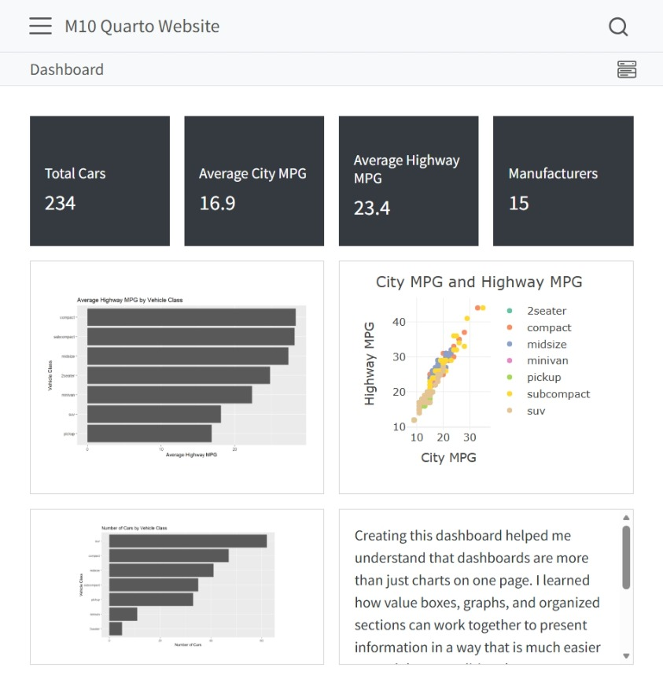

::: section
# Dashboard

This section showcases my ability to organize data into a dashboard format. A marketing dashboard should help viewers quickly understand performance, trends, and areas that may need improvement.
:::

:::: section-light
## Dashboard Purpose

The purpose of this dashboard is to present marketing-related data in a clear and professional way. Instead of only showing raw data, the dashboard should help answer questions such as:

- How are users engaging with the website?
- Which channels or sources are performing best?
- What patterns appear in the data?
- What action should a marketer consider next?

::: highlight-box
A dashboard is strongest when it helps the audience move from data to insight.
:::
::::

:::: section
## Dashboard Preview

::: {.card}

*Figure 1. Interactive dashboard created for my Module 10 Quarto website project.*

This dashboard was developed as part of my Module 10 coursework using Quarto. It combines multiple visualizations into a single interface that presents information in an organized and interactive format. The project demonstrates my ability to create dashboards that communicate data clearly and support data-driven decision-making.

[View Interactive Dashboard](projects-files/M10-Quarto-Website/dashboard.html){.button}

:::
::::
